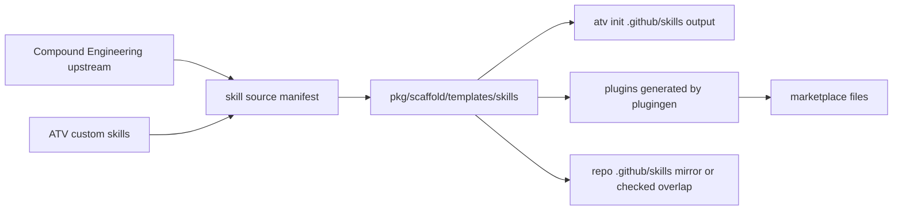

# feat: Establish CE skill source of truth

## Summary

This plan makes `pkg/scaffold/templates/skills` the canonical local ATV skill source for installable product artifacts, treats Compound Engineering as the upstream base for CE-derived skills, and turns generated/plugin/dogfood copies into explicit projections with drift checks.

---

## Problem Frame

ATV currently has multiple skill surfaces that disagree about ownership: `pkg/plugingen` generates plugins from `pkg/scaffold/templates/skills`, while `pkg/scaffold/parity_test.go` still describes `.github/skills` as the editable dogfood source and templates as a periodic snapshot. The current Compound Engineering checkout and installed plugin match each other, but every same-name CE skill currently present in ATV templates differs from the current CE version.

---

## Assumptions

*This plan was authored in LFG pipeline mode without a synchronous confirmation step. The items below are agent inferences that should be scrutinized by downstream review before implementation proceeds.*

- The local Compound Engineering checkout used during planning is a valid current baseline for CE skill content because it matches the installed Insiders Compound Engineering plugin inventory and skill bodies.
- ATV should not absorb every Compound Engineering skill automatically; it should refresh and add only the CE skills needed for ATV's installable product and pipeline dependencies.
- `.github/skills` should remain available for this repository's own dogfooding needs, but it should not be treated as the source of truth for installable ATV product content.
- Source-install and Copilot CLI plugin directories should remain self-contained unless implementation proves all target plugin consumers safely support references to canonical skill paths outside each plugin directory.

---

## Requirements

- R1. Define one canonical local edit location for ATV installable skill content, satisfying origin R11 and R12.
- R2. Compare CE-derived ATV skills against the current Compound Engineering baseline and identify stale, missing, renamed, and ATV-customized skills.
- R3. Preserve ATV-specific skills and workflows while refreshing CE-derived base content where ATV has no intentional customization.
- R4. Make the role of `.github/skills` explicit so it can no longer silently compete with `pkg/scaffold/templates/skills`, satisfying origin R13.
- R5. Keep generated plugin artifacts self-contained and deterministic unless a safer copy-reduction mechanism is proven, satisfying origin R14 and R15.
- R6. Preserve the clean source-install picker and existing generated marketplace split while changing skill source-of-truth behavior, satisfying origin R1, R8, R9, and R10.
- R7. Add verification that maintainers can run to detect CE drift, generated artifact drift, and dogfood/template divergence before release.

**Origin actors:** A1 first-time AgentPlugin user, A2 returning ATV user, A3 ATV maintainer.
**Origin flows:** F1 clean picker stays parallel, F2 metadata-based handoff, F3 productized first chat command, F4 metadata coherence validation, F5 skill source-of-truth hygiene.
**Origin acceptance examples:** AE1, AE2, AE3, AE4, AE5, AE6, AE7, AE8, AE9.

---

## Scope Boundaries

- Do not make rendered README behavior or protocol install links required for this work.
- Do not change the clean one-option source-install picker except where generated validation proves it remains intact.
- Do not replace ATV-specific skills with CE versions when ATV has intentionally different behavior or naming.
- Do not rely on symlinks, hardlinks, or local-only filesystem shortcuts for plugin skill reuse.
- Do not hard-code a developer's local Compound Engineering checkout path into production code or CI.
- Do not remove the `.github/skills` dogfood surface without a separate explicit product decision.

### Deferred to Follow-Up Work

- Full command identity cleanup for `/atv` versus `/atv-everything`: remains part of the onboarding brainstorm, but this plan focuses on skill source freshness and source-of-truth hygiene.
- Broad adoption of all missing CE skills: this plan should add the CE skills required by ATV's current workflows and record the remaining CE inventory for future curation.
- Native extension or marketplace install polish: outside this source-of-truth pass.

---

## Context & Research

### Relevant Code and Patterns

- `pkg/scaffold/catalog.go` embeds `pkg/scaffold/templates` and writes selected skills into target repositories under `.github/skills`.
- `pkg/plugingen/generate.go` reads `pkg/scaffold/templates/skills` and writes `plugins/`, root `marketplace.json`, `.github/plugin/marketplace.json`, and `.claude-plugin/marketplace.json`.
- `pkg/plugingen/generate_test.go` already verifies per-skill plugin generation, pack membership, `atv-everything`, source-install picker shape, generated determinism, and drift reporting.
- `pkg/scaffold/parity_test.go` currently enforces presence parity between `.github/skills` and `pkg/scaffold/templates/skills`, but its comments still define `.github/skills` as editable source and templates as snapshots.
- `pkg/plugingen/packs.go` mirrors guided installer categories and decides which skills appear in generated pack plugins.
- `pkg/tui/categories.go` decides guided installer category labels and layer keys.
- `docs/brainstorms/2026-04-02-compound-engineering-latest-update-brainstorm.md` chose manual curation into templates over submodules or automated subtree sync, with beta skills excluded until stable.

### Planning Inventory Findings

- ATV template skills: 30.
- ATV `.github/skills`: 67.
- Current Compound Engineering reference skills: 35.
- Installed Insiders Compound Engineering skills: 35, matching the local reference by name and body.
- Same-name ATV template and CE skills: `ce-brainstorm`, `ce-compound`, `ce-compound-refresh`, `ce-ideate`, `ce-plan`, `ce-work`, and `lfg`.
- All seven same-name CE skills differ between ATV templates and current CE.
- Several current CE skills are represented in ATV only as older unprefixed aliases, including `frontend-design`, `gemini-imagegen`, `proof`, `resolve-pr-feedback`, `test-browser`, and `setup`.

### Institutional Learnings

- The April 2026 CE update brainstorm rejected submodules/subtrees and generic sync automation in favor of curated copies because ATV embeds templates into the Go binary and needs selective inclusion.
- The newer plugin generator work already established deterministic projection from templates to plugin artifacts and a `-check` mode for drift detection.

### External References

- Compound Engineering reference repository: `https://github.com/EveryInc/compound-engineering-plugin`.
- ATV source repository: `https://github.com/All-The-Vibes/ATV-StarterKit`.

---

## Key Technical Decisions

- Canonical local product source: `pkg/scaffold/templates/skills` is the editable source for installable ATV product skills because both scaffold install and plugin generation can project from it.
- Upstream base for CE-derived skills: Compound Engineering is the base source for CE skills, but ATV keeps an explicit local snapshot and only applies intentional ATV overlays.
- Dogfood surface classification: `.github/skills` remains a repository dogfood/compatibility surface, but overlapping product skills should be generated from or content-checked against templates.
- Generated artifact posture: `plugins/` remains generated output from templates; maintainers should not hand-edit copied skill bodies under generated plugin directories.
- Dependency-closure before wholesale import: refresh existing CE-derived skills and add CE skills required by the latest ATV workflows before considering the rest of the CE catalog.

---

## Open Questions

### Resolved During Planning

- Which local directory should be canonical for installable ATV skill content? Use `pkg/scaffold/templates/skills`.
- Should `.github/skills` be considered the product source of truth? No. Existing tests call it dogfood source, but current plugin/scaffold generation reality makes templates the safer product source.
- Should plugin copies under `plugins/` be de-duplicated by filesystem tricks? No. Keep generated self-contained artifacts unless target consumers prove path references are portable.

### Deferred to Implementation

- Exact CE skill dependency closure: implementation should inspect the current CE skill bodies and include any skills invoked by refreshed pipeline skills.
- Whether any CE-derived ATV skill has intentional local customization: implementation should compare body diffs and classify intentional ATV overlays before overwriting.
- Whether `.github/skills` overlap should be generated by a new command or content-checked by tests only: choose the smallest reliable implementation after touching the actual files.

---

## Output Structure

    pkg/
      skillsync/
        compare.go
        compare_test.go
      scaffold/
        skill_sources.json
        skill_sources_test.go
    cmd/
      skillsync/
        main.go

---

## High-Level Technical Design

> *This illustrates the intended approach and is directional guidance for review, not implementation specification. The implementing agent should treat it as context, not code to reproduce.*

---

## Implementation Units

- U1. **Classify canonical skill sources**

**Goal:** Create a structured inventory that records which skills are ATV-native, CE-derived, external, dogfood-only, or generated projections.

**Requirements:** R1, R2, R3, R4

**Dependencies:** None

**Files:**
- Create: `pkg/scaffold/skill_sources.json`
- Create: `pkg/scaffold/skill_sources_test.go`
- Modify: `pkg/scaffold/parity_test.go`
- Test: `pkg/scaffold/skill_sources_test.go`

**Approach:**
- Add a small manifest that classifies each skill under `pkg/scaffold/templates/skills` by origin and tracking policy.
- Include CE upstream names for CE-derived skills and explicit policy values for ATV-native skills.
- Replace the old dogfood-source wording in parity tests with the new local-source model: templates are canonical for product; `.github/skills` is dogfood/compatibility.
- Keep allow-lists small and named by purpose, so adding to them records an unresolved curation decision rather than hiding drift.

**Execution note:** Start with tests that fail on unclassified template skills and stale allow-list entries before editing source content.

**Patterns to follow:**
- `pkg/scaffold/parity_test.go` presence checks and stale-entry checks.
- `pkg/plugingen/generate_test.go` deterministic output and drift-check style.

**Test scenarios:**
- Happy path: every directory under `pkg/scaffold/templates/skills` has exactly one source classification.
- Edge case: a classified skill directory is removed or renamed, and the test reports the stale manifest entry.
- Error path: a new template skill is added without source metadata, and the test fails with the missing skill name.
- Integration: same-name skills present in both templates and `.github/skills` are either content-equivalent or explicitly classified as dogfood-divergent.

**Verification:**
- Maintainers can answer where a skill should be edited by reading the manifest and tests.
- Existing parity tests no longer claim `.github/skills` is the product source of truth.

---

- U2. **Add CE comparison tooling**

**Goal:** Provide a repeatable way to compare ATV's CE-derived skills against a current Compound Engineering skills directory.

**Requirements:** R2, R3, R7

**Dependencies:** U1

**Files:**
- Create: `pkg/skillsync/compare.go`
- Create: `pkg/skillsync/compare_test.go`
- Create: `cmd/skillsync/main.go`
- Modify: `docs/marketplace.md`
- Test: `pkg/skillsync/compare_test.go`

**Approach:**
- Add read-only comparison logic that accepts an explicit CE skills path and compares it against CE-derived entries in the source manifest.
- Report same, stale, missing upstream, missing local, renamed/alias candidate, and ATV-overlay statuses.
- Keep the comparison command path-driven so no developer-specific checkout path is embedded in code or CI.
- Document how maintainers should run the report before refreshing CE-derived skills.

**Patterns to follow:**
- `cmd/plugingen/main.go` for a small Go command that discovers repo root safely.
- `pkg/plugingen/generate.go` helper style for deterministic traversal and normalized line-ending comparisons.

**Test scenarios:**
- Happy path: identical CE and local skill bodies report as in sync.
- Happy path: differing CE and local skill bodies report as stale with the skill name and both relative roots.
- Edge case: CE has a skill missing locally and the report distinguishes missing-local from intentional ATV-native skills.
- Edge case: ATV has a CE-derived skill whose upstream name differs from local directory name, and the report uses the manifest mapping rather than guessing by directory name.
- Error path: the provided CE skills path is absent or lacks `SKILL.md` files, and the command returns a clear failure.

**Verification:**
- Running the comparison against the current CE reference identifies all seven same-name CE-derived ATV template skills as different before refresh.
- The command can be used without changing any source files.

---

- U3. **Refresh CE-derived skills with ATV dependency closure**

**Goal:** Update ATV's CE-derived skill content from the current CE baseline while preserving ATV-specific skills and adding only required CE workflow dependencies.

**Requirements:** R2, R3, R5, R6

**Dependencies:** U1, U2

**Files:**
- Modify: `pkg/scaffold/templates/skills/ce-brainstorm/**`
- Modify: `pkg/scaffold/templates/skills/ce-compound/**`
- Modify: `pkg/scaffold/templates/skills/ce-compound-refresh/**`
- Modify: `pkg/scaffold/templates/skills/ce-ideate/**`
- Modify: `pkg/scaffold/templates/skills/ce-plan/**`
- Modify: `pkg/scaffold/templates/skills/ce-work/**`
- Modify: `pkg/scaffold/templates/skills/lfg/**`
- Create or modify: `pkg/scaffold/templates/skills/ce-code-review/**`
- Create or modify: `pkg/scaffold/templates/skills/ce-test-browser/**`
- Create or modify: `pkg/scaffold/templates/skills/ce-commit-push-pr/**`
- Modify: `pkg/scaffold/catalog.go`
- Modify: `pkg/tui/categories.go`
- Modify: `pkg/plugingen/packs.go`
- Test: `pkg/scaffold/parity_test.go`
- Test: `pkg/plugingen/generate_test.go`

**Approach:**
- Refresh existing CE-derived skills from current CE where diffs show no intentional ATV overlay.
- Analyze refreshed `lfg` and other pipeline skills for referenced skill dependencies, then include required CE skills rather than leaving broken invocations.
- Keep ATV-specific aliases such as `ce-review`, `document-review`, and `test-browser` until a separate compatibility decision is made.
- Register new CE dependency skills in scaffold catalog layers, TUI categories, and plugingen packs only where they are user-facing or required by bundles.
- Mark any intentional ATV overlay in the source manifest so future sync reports do not treat it as accidental drift.

**Patterns to follow:**
- Existing category placement in `pkg/tui/categories.go`.
- Existing pack definitions in `pkg/plugingen/packs.go`.
- April 2026 CE update brainstorm guidance to copy curated CE content into templates rather than using a submodule.

**Test scenarios:**
- Happy path: refreshed CE skills are present in the guided installer output when their layers are selected.
- Happy path: `atv-everything` generated plugin includes refreshed CE skills and required CE pipeline dependencies.
- Edge case: a new CE dependency skill is not registered in any catalog slice, and parity tests fail with that skill name.
- Integration: source-install marketplace still exposes one flagship plugin after new CE skills are added to templates.
- Integration: CLI marketplace still puts `atv-everything` first and includes new registered skills deterministically.

**Verification:**
- The comparison report no longer marks refreshed CE-tracked skills as stale unless they are explicitly classified as ATV overlays.
- Existing ATV-native skill directories remain present and classified.

---

- U4. **Make dogfood and generated copies non-authoritative**

**Goal:** Prevent `.github/skills` and `plugins/**/skills` from becoming competing hand-edited sources.

**Requirements:** R1, R4, R5, R7

**Dependencies:** U1, U3

**Files:**
- Modify: `.github/skills/**`
- Modify: `pkg/scaffold/parity_test.go`
- Modify: `pkg/plugingen/generate.go`
- Modify: `pkg/plugingen/generate_test.go`
- Test: `pkg/scaffold/parity_test.go`
- Test: `pkg/plugingen/generate_test.go`

**Approach:**
- For same-name overlaps between templates and `.github/skills`, either synchronize content from templates or require an explicit dogfood-divergent classification.
- Preserve `.github/skills` entries that are truly dogfood-only, but keep them separate from the product template inventory.
- Keep generated plugin skill bodies owned by `pkg/plugingen`; extend drift checks if needed so copied plugin bodies match templates after normalization.
- Update comments and failure messages so maintainers know which file to edit first.

**Patterns to follow:**
- Current stale-entry and graduation checks in `pkg/scaffold/parity_test.go`.
- Current `CheckClean` generated tree comparison in `pkg/plugingen/generate.go`.

**Test scenarios:**
- Happy path: a template skill and same-name dogfood skill are identical and pass parity.
- Edge case: a same-name dogfood skill differs without explicit classification, and parity fails with remediation guidance.
- Edge case: a dogfood-only skill is removed but remains in an allow-list, and the test reports the stale allow-list entry.
- Integration: generated plugin copies differ from templates and `go run ./cmd/plugingen -check` reports the generated paths.

**Verification:**
- There is no ambiguous same-name skill copy that can drift silently between product templates and dogfood configuration.

---

- U5. **Regenerate plugin artifacts and preserve install surfaces**

**Goal:** Project the refreshed canonical templates into all installable plugin artifacts and verify marketplace behavior remains clean.

**Requirements:** R5, R6, R7

**Dependencies:** U3, U4

**Files:**
- Modify: `plugins/**`
- Modify: `marketplace.json`
- Modify: `.claude-plugin/marketplace.json`
- Modify: `.github/plugin/marketplace.json`
- Test: `pkg/plugingen/generate_test.go`

**Approach:**
- Regenerate plugin artifacts from templates after CE refresh and source-of-truth enforcement are in place.
- Preserve the root and `.claude-plugin` source-install marketplaces as one flagship ATV entry.
- Preserve CLI granular marketplace support and deterministic ordering.
- Update generated readmes only through the generator.

**Patterns to follow:**
- `pkg/plugingen/generate.go` generation flow.
- `TestGenerate_SourceInstallMarketplaceHasOneFlagshipPlugin` and `TestGenerate_CliMarketplaceListsEveryPlugin`.

**Test scenarios:**
- Covers AE1. Source-install marketplaces contain exactly one flagship ATV entry after regeneration.
- Covers AE6. Metadata changes remain coherent across source-install and CLI marketplace outputs.
- Happy path: every template skill has a corresponding per-skill plugin and appears in `atv-everything`.
- Edge case: generated plugin tree has stale files from renamed skills, and drift check reports them.

**Verification:**
- Generated artifacts are deterministic and no manual edits are needed under `plugins/`.

---

- U6. **Document the skill maintenance workflow**

**Goal:** Make the new source-of-truth model understandable to future maintainers.

**Requirements:** R1, R2, R3, R4, R7

**Dependencies:** U1, U2, U5

**Files:**
- Modify: `docs/marketplace.md`
- Modify: `README.md`
- Modify: `pkg/scaffold/parity_test.go`

**Approach:**
- Document where to edit ATV-native skills, how to compare CE-derived skills, and how to regenerate plugin artifacts.
- Explain that `.github/skills` is dogfood/compatibility, while `pkg/scaffold/templates/skills` is canonical for installable ATV product output.
- Include a short policy for CE updates: compare, classify overlays, refresh required skills, regenerate, and run drift checks.

**Patterns to follow:**
- Existing marketplace docs that explain full bundle versus granular plugin installs.
- Existing test comments that explain drift remediation in actionable language.

**Test scenarios:**
- Test expectation: none -- documentation-only unit. Verification is review for accuracy against implemented command names, paths, and tests.

**Verification:**
- A maintainer can follow the docs to update a CE-derived skill without guessing which duplicate file to edit.

---

## System-Wide Impact

- **Interaction graph:** `pkg/scaffold/templates/skills` feeds `atv init`, generated plugin directories, CLI marketplace output, and source-install marketplace output.
- **Error propagation:** Comparison and drift checks should fail loudly with actionable skill names and paths, not silently skip missing files.
- **State lifecycle risks:** Generated outputs can become stale when skill directories are renamed or removed; drift checks must continue catching stale plugin files.
- **API surface parity:** Guided installer categories, generated packs, `atv-everything`, and source-install flagship plugin must all reflect the same canonical template inventory.
- **Integration coverage:** Unit tests alone are not enough; generated output checks must verify scaffold, pack, bundle, and marketplace surfaces together.
- **Unchanged invariants:** Source-install picker remains one flagship entry; generated plugin directories remain self-contained; ATV-native skills remain part of the installable product.

---

## Risks & Dependencies

| Risk | Mitigation |
|------|------------|
| Refreshing latest CE `lfg` without adding its dependent skills breaks the pipeline. | Analyze referenced skill invocations and add required dependency skills or preserve an ATV-compatible overlay. |
| Treating all CE differences as stale overwrites intentional ATV customization. | Require source manifest policy and overlay classification before copying. |
| `.github/skills` contains many dogfood-only entries and could balloon the installable product if mirrored blindly. | Keep dogfood-only entries explicit and separate from template inventory. |
| New sync tooling becomes another unmaintained path. | Keep it read-only by default, path-driven, and covered by tests. |
| Adding CE skills changes marketplace size or picker behavior. | Preserve one-entry source-install tests and deterministic CLI marketplace tests. |

---

## Alternative Approaches Considered

- Make `.github/skills` canonical: rejected for this pass because it has 67 skills, includes dogfood/historical entries, and is not the source currently used by plugin generation.
- Make Compound Engineering a submodule/subtree: rejected in the April 2026 brainstorm because ATV embeds curated templates into the Go binary and needs selective inclusion.
- Remove generated copies from `plugins/`: deferred until plugin consumers prove they can safely reference canonical paths outside plugin directories.
- Import every CE skill immediately: deferred because ATV needs curated product categories and dependency closure, not an unreviewed catalog expansion.

---

## Documentation / Operational Notes

- Document the source-of-truth policy in `docs/marketplace.md` and `README.md` once command names and validation behavior are implemented.
- Keep CE comparison tooling local-path driven. CI can run generation checks without requiring a CE checkout; CE freshness checks can be a maintainer workflow until an upstream fetch strategy is intentionally designed.
- After implementation, run the generator and verify the source-install picker tests still guard the one-entry experience.

---

## Sources & References

- **Origin document:** `docs/brainstorms/2026-04-29-vscode-agentplugin-first-run-onboarding-requirements.md`
- Related brainstorm: `docs/brainstorms/2026-04-02-compound-engineering-latest-update-brainstorm.md`
- Generator: `pkg/plugingen/generate.go`
- Generator tests: `pkg/plugingen/generate_test.go`
- Scaffold catalog: `pkg/scaffold/catalog.go`
- Scaffold parity tests: `pkg/scaffold/parity_test.go`
- Pack metadata: `pkg/plugingen/packs.go`
- TUI category mapping: `pkg/tui/categories.go`
- External reference: `https://github.com/EveryInc/compound-engineering-plugin`